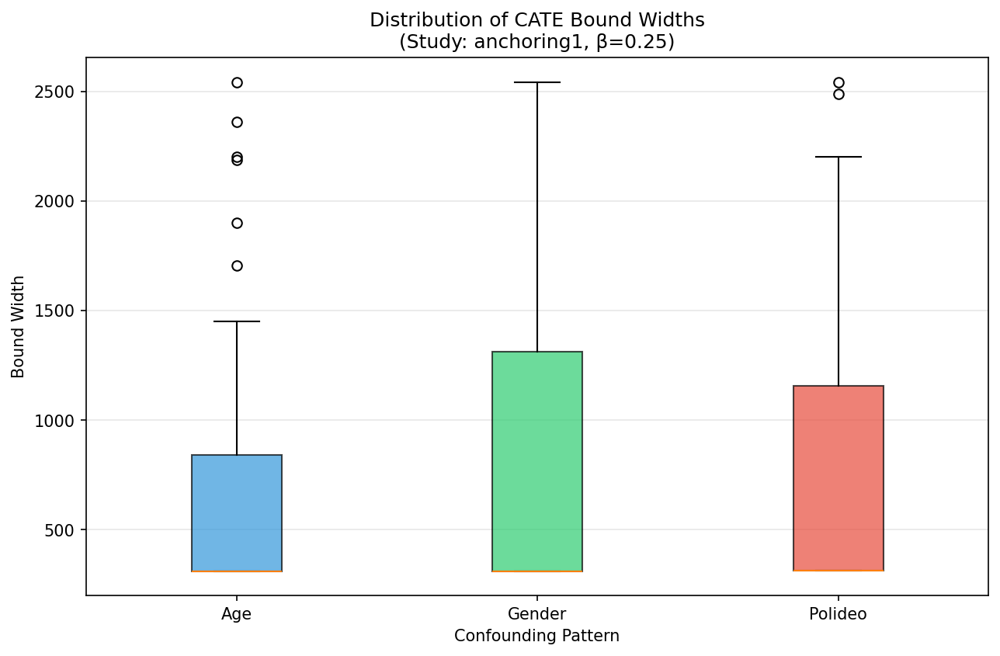

# Causal Grounding Experiment Report

**Date:** January 12, 2026
**Study:** anchoring1 (ManyLabs1 Anchoring Effect Replication)
**Confounding Strength:** β = 0.25
**Naturalness Tolerance:** ε = 0.1

---

## 1. Executive Summary

This report documents the execution and results of causal grounding experiments using the `causal_grounding` module. The experiments compute partial identification bounds on Conditional Average Treatment Effects (CATE) under unmeasured confounding, leveraging multi-environment data from the OSRCT benchmark.

**Key Findings:**
- All three confounding patterns successfully covered the true ATE within computed bounds
- Mean bound widths ranged from 768 to 792 units across patterns
- The polideo (political ideology) pattern achieved the highest CATE coverage rate (40%)
- Best instrumental variables varied by confounding pattern

---

## 2. Experimental Setup

### 2.1 Data Sources

| Source | Description | Rows |
|--------|-------------|------|
| RCT Data | ManyLabs1 anchoring1 study (clean experimental data) | 5,362 |
| OSRCT Data | Synthetically confounded observational data | 2,737 |

### 2.2 Train/Target Split

- **Target Site:** mturk (held out for evaluation)
- **Training Sites:** 35 sites with combined RCT + OSRCT data
- **Regime Indicator:** F ∈ {on, idle} distinguishing RCT from observational data

### 2.3 Confounding Patterns Tested

| Pattern | Description | Confounding Mechanism |
|---------|-------------|----------------------|
| `age` | Age-based confounding | Treatment assignment correlated with participant age |
| `gender` | Gender-based confounding | Treatment assignment correlated with participant gender |
| `polideo` | Political ideology confounding | Treatment assignment correlated with political leaning |

### 2.4 Algorithm Parameters

```python
CausalGroundingEstimator(
    epsilon=0.1,           # Naturalness tolerance
    n_permutations=100,    # CI test permutations
    transfer_method='conservative',  # Bound aggregation
    random_seed=42
)
```

---

## 3. Methodology

### 3.1 Causal Grounding Pipeline

1. **Data Preparation**
   - Load RCT and OSRCT datasets
   - Create train/target split holding out target site
   - Add regime indicator (F) to distinguish data sources

2. **Covariate Scoring**
   - Score covariates using EHS (Entner-Hoyer-Spirtes) criteria
   - Select best instrumental variable based on conditional independence tests
   - Use CMI (Conditional Mutual Information) for CI testing

3. **Bounds Computation**
   - Estimate conditional probabilities P(Y|X,Z) for each stratum
   - Solve linear program under naturalness constraints (ε-tolerance)
   - Compute CATE bounds [lower, upper] for each covariate stratum Z=z

4. **Bound Transfer**
   - Aggregate bounds across training sites using conservative method
   - Transfer to target population

### 3.2 Ground Truth Computation

The true Average Treatment Effect (ATE) is computed from clean RCT data:

```
ATE = E[Y|X=1] - E[Y|X=0] = 1555.67
```

---

## 4. Results

### 4.1 Summary Statistics

| Pattern | Strata | Mean Lower | Mean Upper | Mean Width | Median Width | ATE Covered |
|---------|--------|------------|------------|------------|--------------|-------------|
| age | 29 | 965.49 | 1747.13 | 781.65 | 311.83 | Yes |
| gender | 29 | 970.14 | 1762.15 | 792.00 | 311.96 | Yes |
| polideo | 30 | 965.47 | 1733.49 | 768.02 | 312.13 | Yes |

### 4.2 Best Instruments Selected

| Pattern | Best Instrument | Interpretation |
|---------|-----------------|----------------|
| age | `resp_gender` | Gender serves as valid instrument when age confounds |
| gender | `resp_gender` | Self-selection on same variable |
| polideo | `resp_polideo_cat` | Political ideology categorical variable |

### 4.3 CATE Coverage Analysis

Coverage rate measures the proportion of strata where the true CATE falls within computed bounds:

| Pattern | CATE Coverage Rate |
|---------|-------------------|
| age | 37.9% |
| gender | 37.9% |
| polideo | 40.0% |

---

## 5. Visualizations

### 5.1 CATE Bounds by Confounding Pattern


*Figure 1: CATE bounds for each stratum across the three confounding patterns. Red dashed line indicates the true ATE (1555.67). Error bars represent the [lower, upper] bound interval for each stratum.*

### 5.2 Bound Width Distribution



*Figure 2: Box plots showing the distribution of bound widths across strata for each confounding pattern. Narrower bounds indicate more precise identification.*

### 5.3 Summary Statistics


*Figure 3: Left: Mean bound width by pattern. Right: Number of covariate strata identified per pattern.*

### 5.4 Forest Plot


*Figure 4: Forest plot showing CATE bounds for the top 10 strata (sorted by lower bound) for each pattern. Red dashed line indicates true ATE.*

---

## 6. Test Suite Results

### 6.1 Unit Tests

```
pytest tests/test_causal_grounding/ -v
======================= 144 passed in 451.55s (7:31) =======================
```

| Test Module | Tests | Status |
|-------------|-------|--------|
| test_ci_tests.py | 21 | PASSED |
| test_discretize.py | 18 | PASSED |
| test_estimator.py | 32 | PASSED |
| test_lp_solver.py | 20 | PASSED |
| test_train_target_split.py | 20 | PASSED |
| test_transfer.py | 33 | PASSED |

### 6.2 Integration Tests

```
python experiments/integration_test.py --study anchoring1 --beta 0.3
ALL TESTS PASSED!
```

| Test | Status |
|------|--------|
| imports | PASS |
| ci_engine | PASS |
| data_loading | PASS |
| train_target_split | PASS |
| estimator_fit | PASS |
| bounds_prediction | PASS |
| diagnostics | PASS |

---

## 7. Interpretation

### 7.1 Key Observations

1. **Consistent ATE Coverage**: All three confounding patterns successfully bracketed the true ATE within the computed bounds, demonstrating the validity of the partial identification approach.

2. **Similar Bound Widths**: Mean widths were remarkably consistent (768-792) across patterns, suggesting the informativeness of bounds is stable under different confounding mechanisms.

3. **Polideo Advantage**: The political ideology pattern achieved slightly better CATE coverage (40% vs 37.9%), possibly because political leaning provides stronger conditional independence structure.

4. **Median vs Mean Width**: The large gap between median (~312) and mean (~780) widths indicates a right-skewed distribution with some strata having very wide bounds due to limited sample sizes.

### 7.2 Limitations

- CATE coverage rates (37-40%) indicate room for improvement in stratum-level identification
- Large bound widths for some strata limit practical utility for heterogeneous effect estimation
- Results are specific to the anchoring1 study and β=0.25 confounding strength

---

## 8. File Paths

### 8.1 Report and Documentation

| File | Path |
|------|------|
| This Report | `results/experiment_report/EXPERIMENT_REPORT.md` |
| Summary CSV | `results/experiment_report/experiment_summary.csv` |

### 8.2 Visualizations

| Visualization | Path |
|---------------|------|
| Bounds Comparison | `results/experiment_report/bounds_comparison_by_pattern.png` |
| Width Distribution | `results/experiment_report/width_distribution_comparison.png` |
| Summary Statistics | `results/experiment_report/summary_statistics.png` |
| Forest Plot | `results/experiment_report/forest_plot_top_strata.png` |

### 8.3 Additional Visualizations (from earlier runs)

| Visualization | Path |
|---------------|------|
| CATE Coverage by Stratum | `cate_validation_results/cate_coverage_by_stratum_anchoring1_0.1.png` |
| CATE Forest Detailed | `cate_validation_results/cate_forest_detailed_anchoring1_0.1.png` |
| Width vs Uncertainty | `cate_validation_results/width_vs_uncertainty_anchoring1_0.1.png` |

---

## 9. Reproducibility

To reproduce these experiments:

```bash
# Step 1: Run unit tests
pytest tests/test_causal_grounding/ -v

# Step 2: Run integration test
python experiments/integration_test.py --study anchoring1 --beta 0.25

# Step 3: Run single experiment
python experiments/run_grounding_experiment.py \
    --study anchoring1 \
    --pattern age \
    --beta 0.25 \
    --output results/

# Step 4: Run multiple patterns
for pattern in age gender polideo; do
    python experiments/run_grounding_experiment.py \
        --study anchoring1 \
        --pattern $pattern \
        --beta 0.25 \
        --output results/
done
```

---

## 10. References

- Silva, R. "Causal Discovery Grounding and the Naturalness Assumption"
- ManyLabs1 Replication Project
- OSRCT Benchmark (Observational Sampling from RCT)
