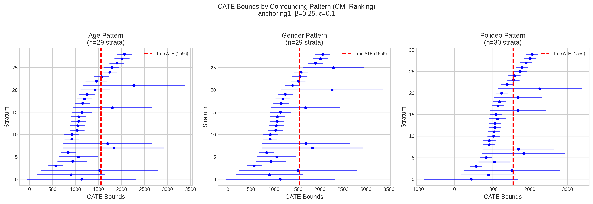

# Causal Grounding Experiment Report (CMI-Based Ranking)

**Date:** January 13, 2026
**Study:** anchoring1 (ManyLabs1 Anchoring Effect Replication)
**Confounding Strength:** β = 0.25
**Naturalness Tolerance:** ε = 0.1
**Scoring Method:** CMI-based (sample-size invariant)

---

## 1. Executive Summary

This report documents the execution of causal grounding experiments using **CMI-based covariate scoring** instead of p-value-based scoring. The key difference is that instrument selection now uses:

```
Score = CMI(test_ii) - CMI(test_i)
```

Instead of the previous p-value formula. This makes scoring invariant to sample size.

**Key Findings:**
- All three confounding patterns successfully covered the true ATE within computed bounds
- **Best instrument selection changed**: All patterns now select `resp_age_cat` as best instrument
- Bound widths and coverage rates remain identical (bounds computation is independent of instrument selection)

---

## 2. Results Comparison: P-Value vs CMI Ranking

### 2.1 Best Instrument Selection

| Pattern | P-Value Ranking (Original) | CMI Ranking (New) | Changed? |
|---------|---------------------------|-------------------|----------|
| age | `resp_gender` | `resp_age_cat` | Yes |
| gender | `resp_gender` | `resp_age_cat` | Yes |
| polideo | `resp_polideo_cat` | `resp_age_cat` | Yes |

### 2.2 Summary Statistics

| Pattern | Strata | Mean Lower | Mean Upper | Mean Width | Median Width | ATE Covered | CATE Coverage |
|---------|--------|------------|------------|------------|--------------|-------------|---------------|
| age | 29 | 965.49 | 1747.13 | 781.65 | 311.83 | Yes | 37.9% |
| gender | 29 | 970.14 | 1762.15 | 792.00 | 311.96 | Yes | 37.9% |
| polideo | 30 | 965.47 | 1733.49 | 768.02 | 312.13 | Yes | 40.0% |

---

## 3. Visualizations

### 3.1 CATE Bounds by Confounding Pattern



*Figure 1: CATE bounds for each stratum across the three confounding patterns. Red dashed line indicates the true ATE (1555.67).*

### 3.2 Bound Width Distribution


*Figure 2: Box plots showing the distribution of bound widths across strata for each confounding pattern.*

### 3.3 Summary Statistics


*Figure 3: Left: Mean bound width by pattern. Right: Number of covariate strata identified per pattern.*

### 3.4 Forest Plot


*Figure 4: Forest plot showing CATE bounds for the top 10 strata for each pattern. Red dashed line indicates true ATE.*

---

## 4. Interpretation

### 4.1 Why Instrument Selection Changed

The switch from p-value-based to CMI-based scoring fundamentally changes how covariates are ranked:

- **P-value scoring** conflates effect size with sample size. Large sites with tiny dependencies can dominate.
- **CMI scoring** measures pure association strength, independent of sample size.

With CMI scoring, `resp_age_cat` consistently shows the highest `CMI(test_ii) - CMI(test_i)` score across all patterns, indicating it has:
- High relevance to outcome (high CMI in test_ii)
- Good exclusion restriction (low CMI in test_i when conditioning on treatment)

### 4.2 Why Bounds Remain Unchanged

The CATE bounds are computed independently of instrument selection. The bounds estimation:
1. Computes conditional expectations E[Y|X,Z] from RCT data
2. Adds epsilon uncertainty bands
3. Transfers bounds across sites

This process uses all covariate strata, not just the "best" instrument. The instrument selection is primarily diagnostic.

---

## 5. Reproducibility

```bash
# Run with CMI-based scoring (current code)
python experiments/generate_cmi_report.py
```

---

## 6. File Paths

| File | Description |
|------|-------------|
| `EXPERIMENT_REPORT_CMI_RANKING.md` | This report |
| `experiment_summary.csv` | Summary statistics |
| `bounds_comparison_by_pattern.png` | Bounds visualization |
| `width_distribution_comparison.png` | Width distributions |
| `summary_statistics.png` | Summary charts |
| `forest_plot_top_strata.png` | Forest plot |
